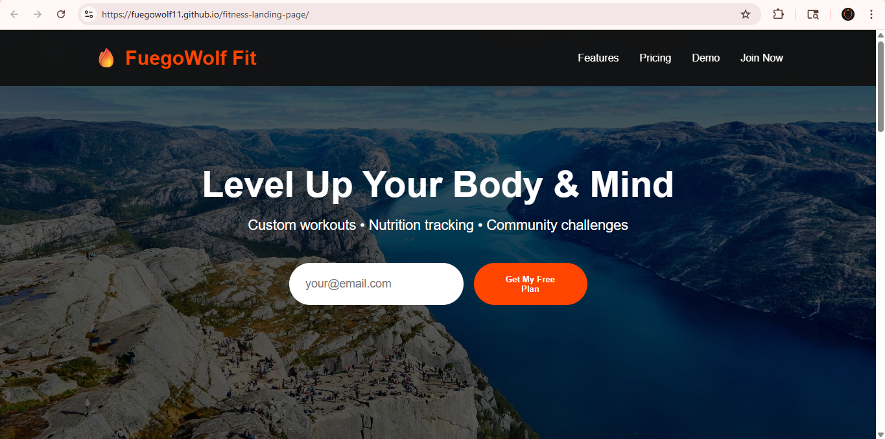
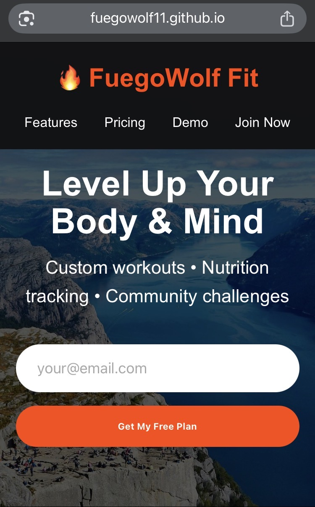

# fuegowolf-fit
## 🔥 Fuegowolf Fit – Fitness & Crypto Web Apps

Front-End Developer specializing in **Fitness Tech** & **Web3 / Crypto** interfaces. Turning real-world domains into beautiful, responsive experiences.

### 🏋️ Fitness Projects
- [Rep Tracker](link-here) – Track sets, reps, PRs with localStorage
- [Workout Logger](https://fuegowolf11.github.io/workout-logger) – Track workout date, time, and type
- [Fitness Landing Page](https://fuegowolf11.github.io/fitness-landing-page/) – Responsive gym membership site (Responsive Web Design)
- [Macro Calculator](https://fuegowolf11.github.io/macro-calculator/) – Nutrition tracker with localStorage persistence (JavaScript)

### ₿ Crypto Projects
- [Crypto Price Tracker](link-here) – Live market data via CoinGecko API
- [DeFi Portfolio Simulator](link-here) – Mock wallet + charts
- [NFT Gallery Demo](link-here) – Responsive card grid
- [Crypto Price Tracker](https://fuegowolf11.github.io/crypto-price-tracker/) – Real-time prices using CoinGecko API (JavaScript)
- [Crypto Portfolio Tracker](https://fuegowolf11.github.io/crypto-portfolio-tracker/) – Personal holdings value calculator (JavaScript
- [Crypto Price Tracker](https://github.com/fuegowolf11/crypto-price-tracker) – Live real-time prices via CoinGecko API
- [Crypto Portfolio Tracker](https://github.com/fuegowolf11/crypto-portfolio-tracker) – Portfolio simulator with CoinGecko
- [Real-Time Crypto Price Dashboard](https://github.com/fuegowolf11/crypto-price-dashboard) – Live prices for BTC, ETH, SOL, XRP, and more
- [Chainlink Oracle Price Feed Demo](https://github.com/fuegowolf11/chainlink-price-feed-demo) – Simulated decentralized oracle dashboard

### 📜 freeCodeCamp Certifications
- Responsive Web Design (March 5, 2026)
- JavaScript (March 16, 2026)

## Screenshots

Currently progressing through freeCodeCamp’s Full Stack Developer curriculum and actively exploring Chainlink oracles, decentralized data feeds, and Web3 front-ends.
**Skills**: HTML5 • CSS3 (Flexbox/Grid) • JavaScript • Responsive Design • Fetch API • Git
